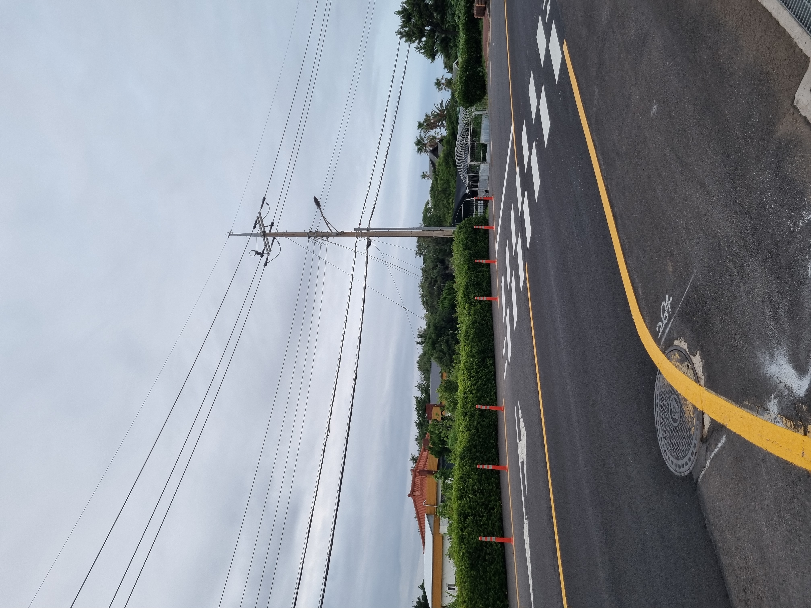
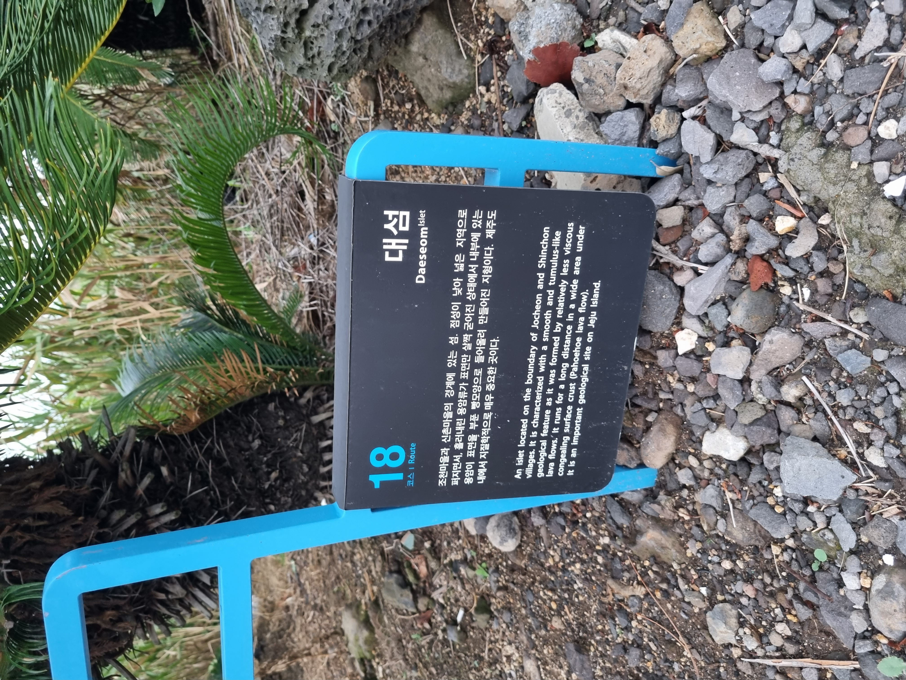
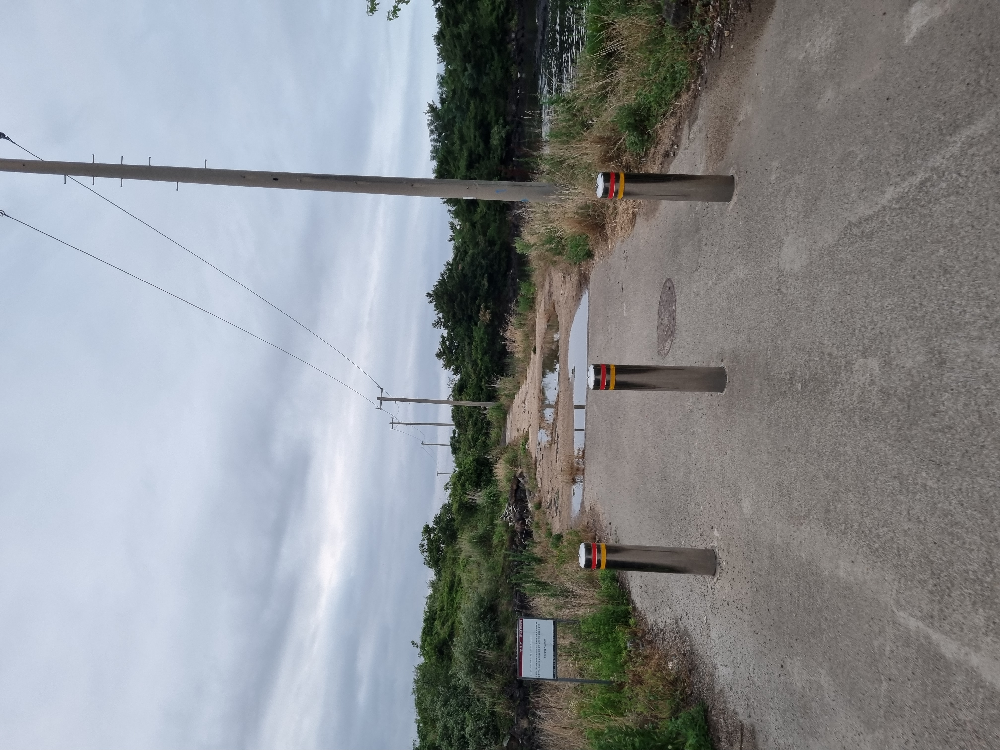
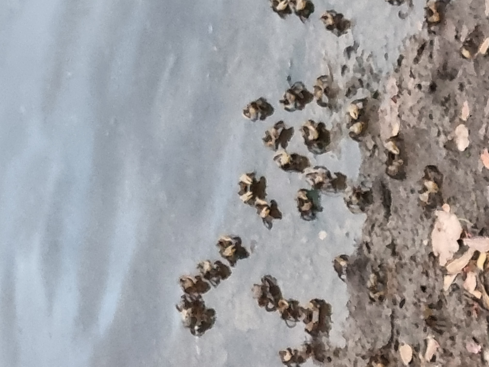
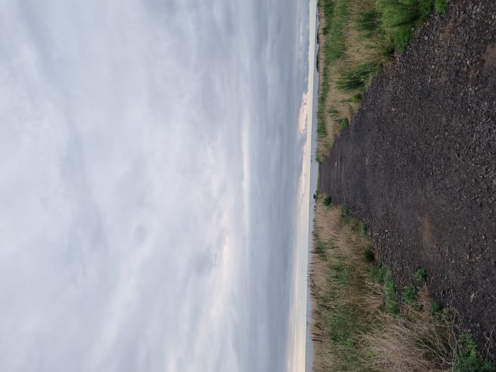
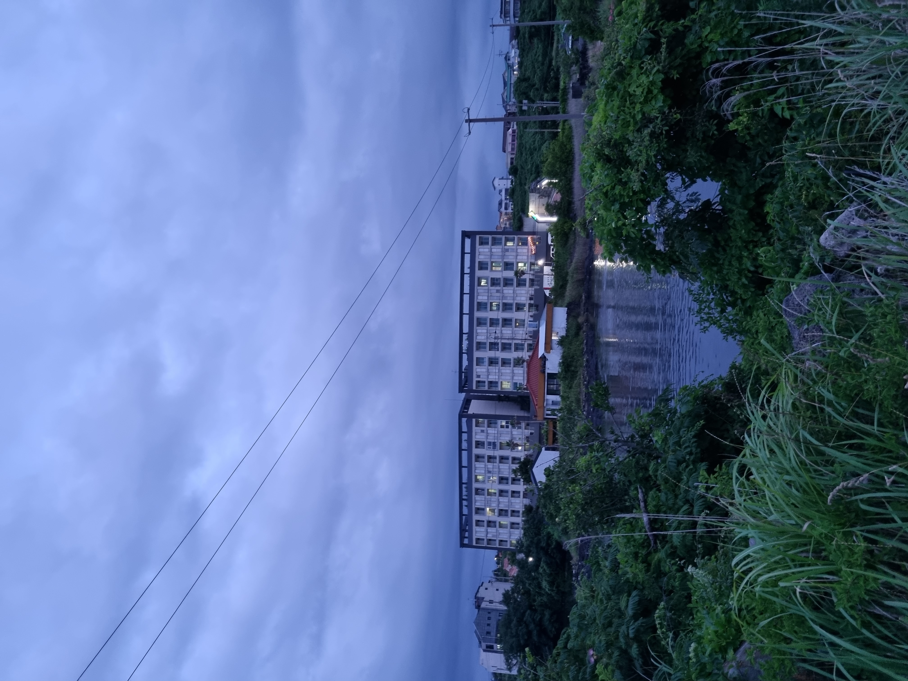
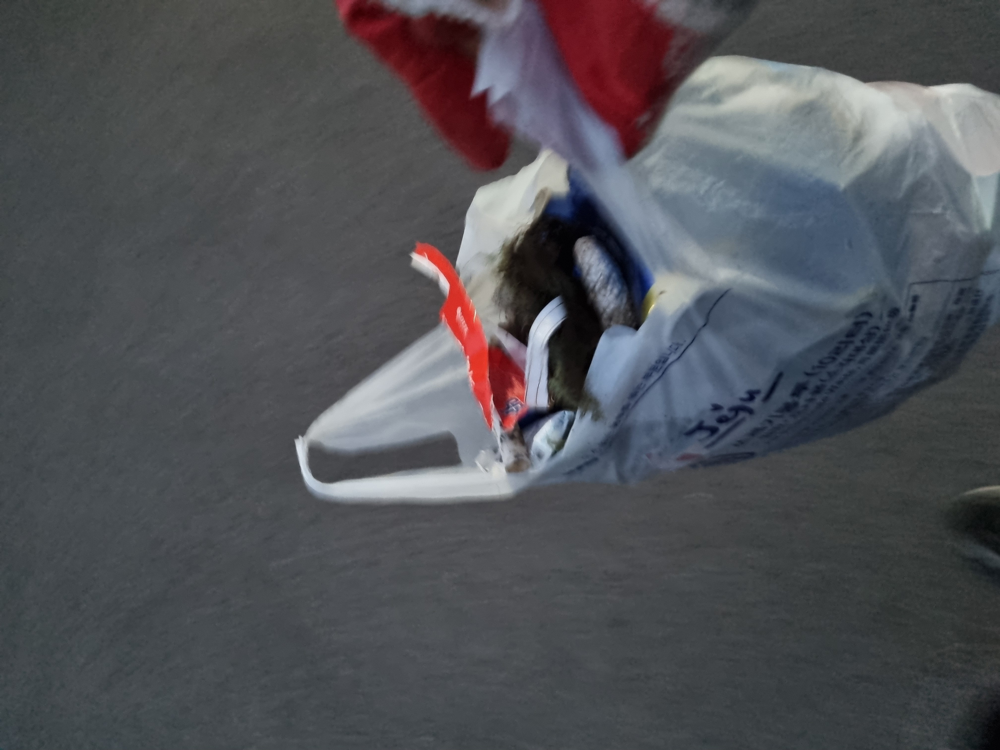
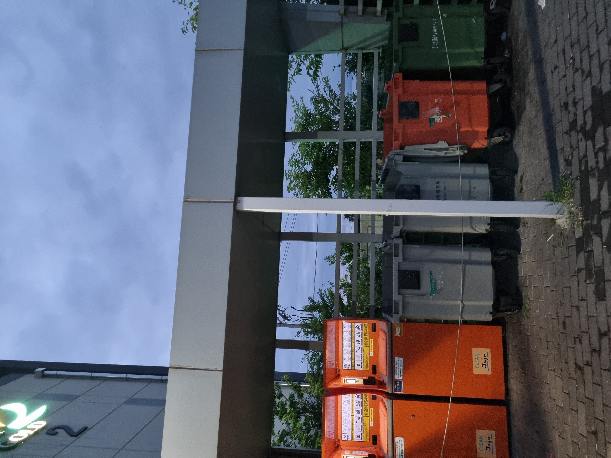

2017년도에 양조장 취업으로 제주도에 내려와 지낸지 어연 5년이 되어간다. 제주가 좋아서 내려온게 아니였는데 살다보니 제주에서 좋아하는 곳만 자주 가게 되었다. 환경보존이나 정의심이 있는건 아니지만 그저 내가 가는 산책길이 깨끗했으면 하는 마음에 바다를 가도 오름을 가도 손에 들을수 있고 주울수 있는 쓰레기는 줍곤 했었다. 

그러다 문득 매일 주워보면 변화가 있을까하는 마음으로 바로 집앞 건너편에 있는 죽도 혹은 대섬에서 산책 겸 쓰레기 줍기를 해보려고 한다. 체중감량을 위해 약 두달간 정말 산책을 많이 했었는데 그때 운동도 되고 정신에도 도움이 많이 되었었다. 겸사겸사 같이 해보려 한다.

집에서 나와 바로 횡단보도 하나만 건너기만 하면 대섬으로 갈수 있다. 이 부근에서는 횡단보도는 좌우로 있는

초등학교 앞까지는 가야 나온다. 술먹고 건너지만 않으면 안위험할거 같다. 음주 측정도 많이 하는 곳이다.

올레길 표지판에 대섬에 대한 설명이 있다. 지질학적으로 매우 중요한 곳이라는 내용은 거진 모든 제주내 장소에 적혀 있는 것 같다. 그만큼 제주 자체가 중요하다는것을 강조한다. 올레길이기에 주말이든 평일이든 집에서 바라다보면 사람들이 꽤나 많이 찾는 곳이다. 입구 바로 옆에는 주택 2~3채가 있다. 

초입 이후부터는 차량출입이 통제되어 있다. 낚시, 올래길 트레킹 등으로 방문하는 사람들이 보통 부근에 차를 많이 세우다보니 주변에 물티슈나 일회용 커피컵, 물병등이 버려져 있었다.여기만 다 주워도 들고나온 종량제 봉투가 바로 다 찰것 같은 느낌이 들어 오늘은 가볍게 주우며 일단 죽도 멀리까지는 가보자는 생각을 했다. 

바로 바다랑 맞닿아 있다보니 옆 웅덩이의 물이 빠진 부분에는 이렇게 작은 게들이 모여있었다. 걷는 길에도

작은게, 갯강구들이 많이 있기에 꼭 슬리퍼가 아닌 신발과 발목이 약간이라도 있는 양말 착용이 필수다.

봄, 가을에는 작은뱀도 지나다닌다. 저 웅덩이에는 계절이 변하면 많은 철새들이 쉬다간다.

여기 지나갈때마다 독일 영화 녹킹온헤븐스도어가 생각난다. 마지막 장면과 겹쳐지며 떠오르는 부분이 있다. 여기서부턴 큰 쓰레기보단 담배꽁초와 개똥이 많이 보였다. 집에서 바라보면 큰개, 작은개 여기선 목줄없이 다니는 경우가 잦다. 그만큼 배변도 방치하는 경향이 큰것 같다. 허연 물체가 있어 주워보려 했는데 뒤집어보니 개똥이였다. 너무 많다.

 

거진 끝까지 걸어오다보면 이렇게 해양쓰레기들을 모아놓은 공간도 있다. 수거하는 모습은 못봤는데 매번 이렇게 쌓여있진 않으니 수거차량이 주기적으로 들어와서 수거해가는것 같다. 선착장이 동네 양옆으로 있다보니 이렇게 큰 그물이나 해양쓰레기들이 많이 나오는 것 같다. 죽도에는 낚시하러 오는 분들도 많아 낚시바늘, 찌 등 관련된 쓰레기들이 많이 보였다. 

별 생각없이 줍다보니 어느새 해가 저물었다. 웅덩이 사이로 보이는 우리 아파트. 날이 더워지니 확실히 큰 새들이 안보이기 시작했다. 저 빨간 지붕 주택에는 수탉이 사는걸로 추정된다. 새벽 5시면 어김없이 이른아침을 알려준다.

생각난 김에 줍자는 마음으로 공사현장에서 주운 목장갑과 차에 1/4 담겨진 종량제 봉투만 들고 죽도로 향했더니 얼마 줍지도 못했다. 캔, 병 등 분리수거 해야할 것 들이 부피를 차지하다보니 생각보다 많이 못주웠다. 첫날이기에 눈에 보이기만 하는걸 줍기도 했다. 집게도 사고 더큰 봉투도 사야한다고 생각했다.

우리 아파트 단지내에 있는 클린하우스. 제주도는 분리수거를 클린하우스, 재활용품 수거센터에서 실시하고 있어서 육지처럼 골목길에 쓰레기를 내놓은다거나 하는일은 없다. 그런 부분은 청결하지만 약간은 아쉬운 부분들이 존재하기도 한다. 시간을 떼우거나 봉투를 꽉 채우는게 목표가 아니었지만 시간이 훌쩍 흘렀다. 내일은 최소한의 장비 업데이트로 다시 주워보려한다.
