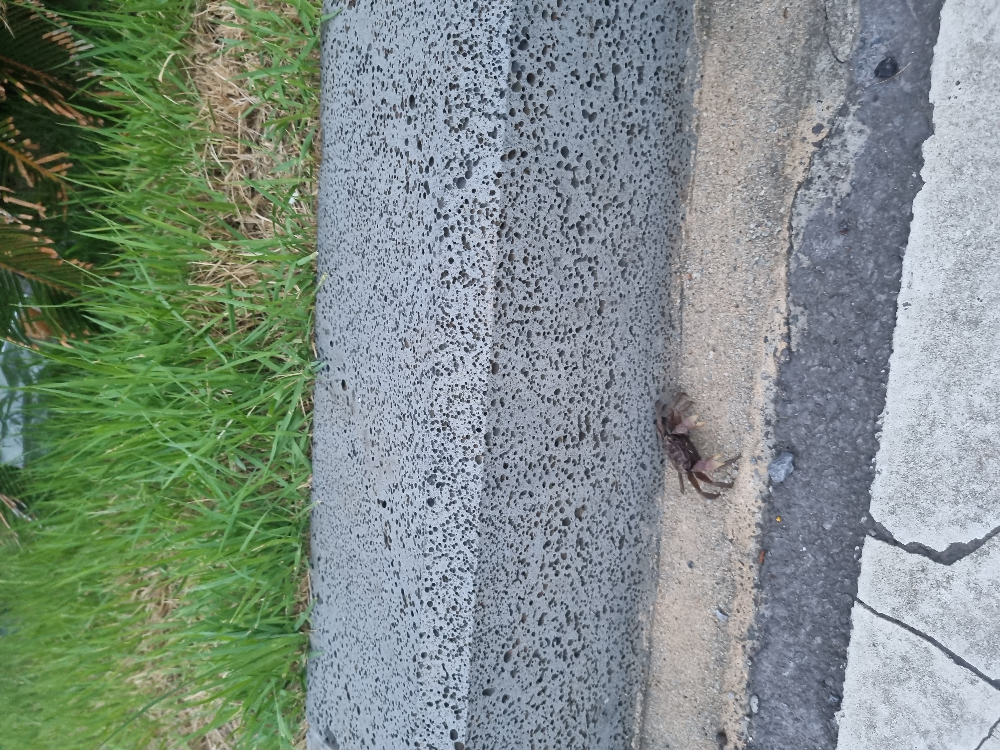
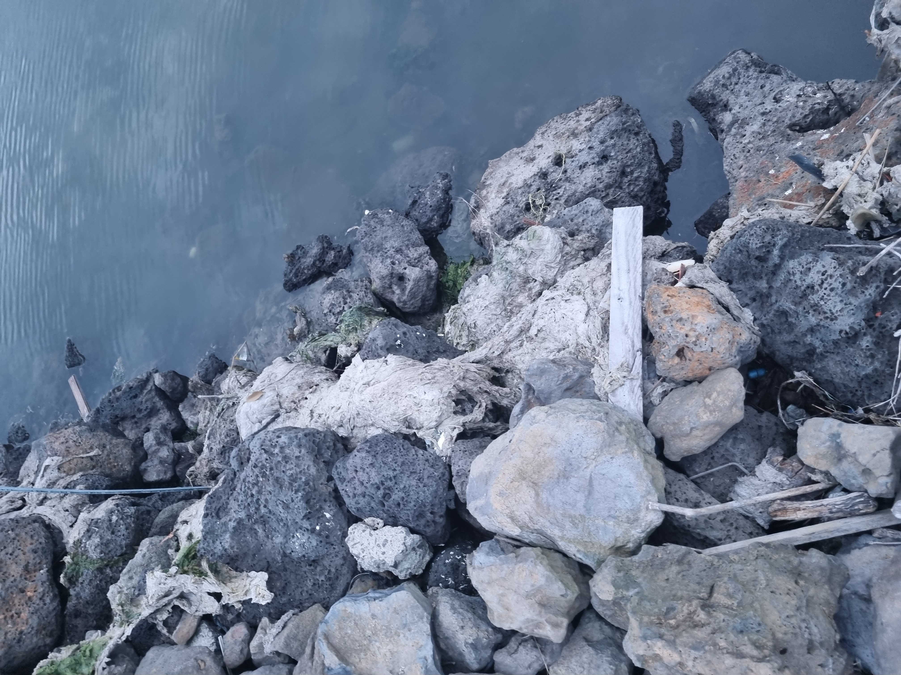
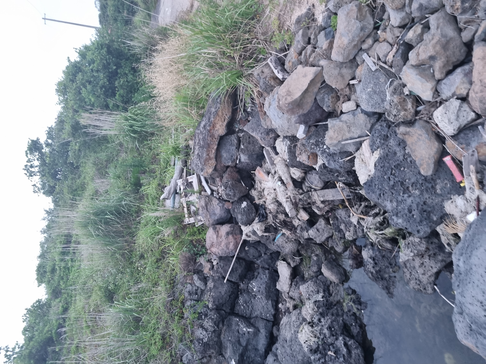
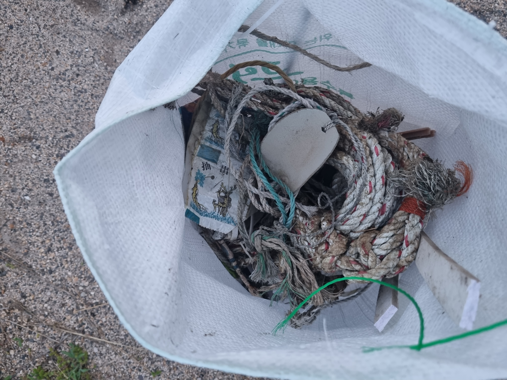
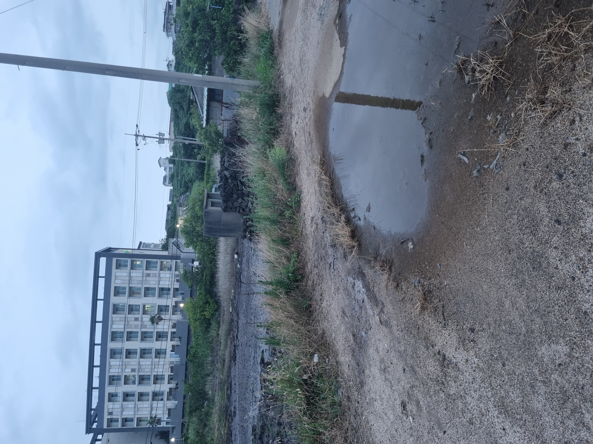
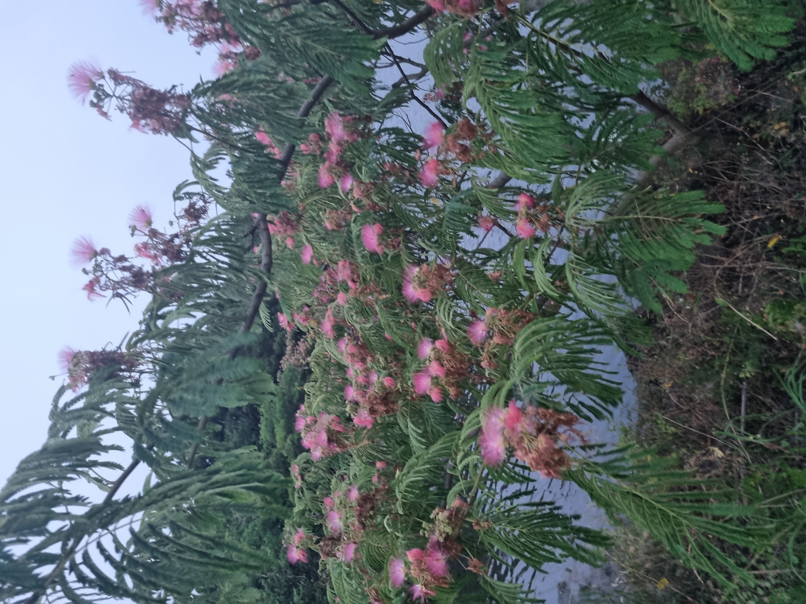

무더운 날씨 때문에 노을이 내려올때쯤 집을 나서 산책 겸 줍기를 하고있다. 어제는 아무생각없이 종량제 봉투에 목장갑으로 주웠더니 허리에 근육통이 왔다. 그래서 조금은 편하려고 철물점에서 집게를 샀다. 나름 운동을 하고있지만 분명 노동과 운동은 다르다. 다만 몇일이라도 꾸준히 주우면 달라질까. 바다와 맞닿아 있기에 그러긴 힘들것 같다. 그래도 오늘도 주워본다.   

주차장을 나오자마자 게가 이만치 올라와있다. 간혹 바다와 가까운 곳에는 겟강구, 게가 여름이면 심심치 않게 올라오는 제주다. 길을 잃어버린 것인지 목적을 갖고 온건지는 알수 없다. 다만 볼때마다 여기 왜 있나 싶다. 

바로 초입을 지난 부근인데 사진에서 보이는 물의 흐름처럼 땅 밑을 통해 물이 들어가고 빠지고 한다. 그때 밀려오는 쓰레기들이 바위틈에 끼이거나 걸처있다. 초입에서는 느껴볼 수 없는 약간 불쾌한 바다의 향이 난다. 너무 과한 미역과 옅은 오물의 냄새가 뒤섞여있다.

 

미역인지 무엇인지 정체모를 바다해초들에 쓰레기들이 뒤엉켜 굳어 있다. 아직 조금은 축축하지만 어느 정도 바스락 거리는 뭉치들을 들썩여보니 쓰레기들이 후두둑 떨어지곤 했다. 이런 뭉치들이 꽤나 있다보니 오늘은 섬안으로 나아가지 못할 것 같다는 생각이 들었다.

고추기름캔, 플라스틱병, 비타민음료병 등 여러 쓰레기들이 많았지만 유독 밧줄이 많이 나왔다. 대부분 길지는 않지만 어디선가 매듭으로 쓴만큼의 길이의 밧줄들이였다. 바다에서는 묶은것도 많고 그만큼 풀린 것도 많나 싶었다.

긴 밧줄도 있었고 여러길이와 두께의 밧줄들이 흩어져있었다. 

어제는 종량제 봉투에 일반 쓰레기와 재활용 쓰레기들을 같이 담고 분리해서 버렸는데 봉투가 약한 것 같아 마대를 구매했는데 읽어보니 불연성이었다. 타지 않는 쓰레기들을 담는 용도다 보니 다시 종량제에 옮기고 재활용은 분리해서 버렸다. 들고다니기에는 마대가 유용하니 번거롭더라도 이런 방식으로 주워도 괜찮을것 같다. 하루 더 써보고 불편하면 다른 방식을 생각해봐야겠다.

역시나 멀리 나가지 못했고 아파트가 바로 보이는 입구에서만 줍다보니 어느덧 어둑해졌다. 물이 빠진 곳에는 뻘이 남고 이럴때면 바다향이 더 짙게 느껴진다. 게들도 엄청 보인다. 

조금 걷다보니 분홍빛 꽃의 나무 두그루에서 향기가 났는데 집에 와서 찾아보니 홍자귀나무 라고한다. 아카시아 향이 나길래 비슷한 과인줄 알았는데 전혀 달랐다. 향기를 맡고 있는데 웨딩사진을 촬영을 마친 사람들이 지나갔다. 내 행태가 이목을 끄는것 같아 보이지만 신경 쓰지않고 내 할일을 마치고 분리 배출 후 집으로 돌아왔다. 비가 자주 오는 제주도인데 이시간대에 만약 비가 온다면 어떤 복장으로 나가야할지 쓸데없이 고민을 해봤다.